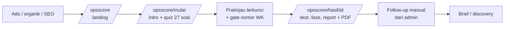

# Brief Dev — OpsScore (Lead-gen Assessment) di coderoach.id

2026-09-17 · @Someone

> **Revisi 2026-09-17** (disetujui pemilik produk setelah M3):
> - Nama dan nama usaha diminta di awal quiz (bagian Intro). Bidang usaha, omset, dan jumlah karyawan menjadi pembuka bagian Penjualan & prospek, Keuangan & kas, dan Tim & peran owner. Gate di akhir tinggal nomor WA dan persetujuan.
> - Profil dan jawaban disimpan diam-diam ke server setiap bagian selesai, dan saat tab disembunyikan atau ditutup.
> - Aturan animasi dilonggarkan untuk momen skor dan hasil (bagian 7).
> - Setiap pertanyaan punya satu contoh atau analogi di bawahnya, dan layar pembuka menjelaskan skala "di mana data hidup" (bagian 4 dan 7).
> - Quiz dikelompokkan jadi 6 bagian: Intro, Penjualan & prospek, Operasional & stok, Keuangan & kas, Tim & peran owner, Digitalisasi & AI. Skor dan report tetap per 8 area (bagian 7).
> - Lima pertanyaan terpanjang (A4, B3, C2, F1, H2) dipendekkan; detailnya pindah ke kotak contoh. Id dan opsi tidak berubah (bagian 4).
> - Gate dipindah ke depan hasil: setelah quiz, pengunjung melihat pratinjau hasil yang terkunci, lalu skor, fase, dan report terbuka setelah nomor WA diisi (bagian 2 dan 8).
> - Kartu skor per bagian memakai adegan animasi yang menggambarkan kata kunci bagian; kondisi adegan mengikuti skor (bagian 7).
> - Fase jadi persona dengan julukan, kekuatan, penghambat, dan ilustrasi animasi: The Juggler (Si Paling Hafal), The Connector (Si Paling Fast Response), The Organizer (Si Paling Excel), The Autopilot (Si Paling Siap AI) (bagian 5 dan 6).
> - Report ditambah tiga saran: langkah naik fase yang dihitung dari rumus skor, quick win minggu ini, dan rencana 30-60-90 hari (bagian 6).
> - Hasil menampilkan benchmark "Gambaran kompetisi": estimasi rata-rata usaha sebidang dari data publik, diganti rata-rata asli setelah 30 usaha sebidang; kartu skor bagian diberi fakta sekilas (bagian 6 dan 7).
>
> Bagian yang berubah ditandai *(revisi)*.

## 1. Konteks & tujuan

Bangun fitur assessment gratis "OpsScore" di coderoach.id sebagai lead generator untuk lini SYS (sistem operasional internal) dan WEB. Pengunjung datang dari ads, konten organik, dan SEO, mengisi 27 pertanyaan dalam ±5 menit, lalu mendapat report fase bisnis + 3 area prioritas yang bisa disimpan sebagai PDF.

Narasi produk: **AI itu langkah ketiga, bukan pertama** — urutannya tercatat → tersistem → AI. Assessment mengukur di mana data operasional bisnis hidup sekarang (kepala owner, chat, spreadsheet, aplikasi, sistem), bukan kematangan HR. Coderoach jual sistemnya; AI menyusul setelah data rapi. Diksi di seluruh fitur harus konsisten dengan ini — jangan menjanjikan "pasang AI".

Brief ini ditulis untuk dieksekusi via Claude Code di repo website coderoach.id yang sekarang (Next.js). Tabel pertanyaan, aturan skor, dan copy di dokumen ini adalah sumber kebenaran; kalau kode dan dokumen beda, dokumen yang benar sampai diubah di sini.

**Metrik sukses (60 hari pertama setelah rilis)**

| Metrik | Target | Kill criteria |
| --- | --- | --- |
| Completion rate (mulai → hasil di layar) | ≥ 40% | < 25% → potong pertanyaan, bukan tambah fitur |
| Gate conversion (hasil → isi nomor WA) | ≥ 50% | < 30% → geser posisi gate atau ubah copy |
| Lead terkualifikasi (omset ≥ Rp 50 jt/bln) | ≥ 30% dari lead | — |
| Brief masuk yang berawal dari assessment | ≥ 1 | 0 dalam 60 hari → hentikan iterasi, biarkan berjalan apa adanya |

Angka target ini asumsi awal, bukan benchmark tervalidasi. Yang penting metriknya terukur sejak hari pertama (lihat bagian 8).

## 2. Scope MVP & non-goals

MVP dikerjakan dalam tiga milestone berurutan (detail di bagian 11); yang di kolom "Nanti" tidak dikerjakan sebelum metrik 60 hari terbaca.

| Area | MVP (rilis pertama) | Nanti (setelah data 60 hari) |
| --- | --- | --- |
| Landing | Satu halaman `/opsscore`: janji, durasi, 1 CTA | Varian landing per angle ads (A/B) |
| Quiz | 27 pertanyaan, satu per layar, branching stok, autosave | Varian pertanyaan untuk bisnis jasa proyek |
| Hasil | Fase + skor per area di layar, 3 area prioritas | Perbandingan dengan rata-rata industri sejenis |
| Gate *(revisi)* | Nomor WA + persetujuan. Nama, brand, bidang usaha, karyawan, dan omset sudah dikumpulkan di dalam quiz | Lead scoring otomatis, sinkron ke Notion |
| Report | Halaman report lengkap + print-to-PDF via CSS print | PDF server-side ber-branding, dikirim ke WA |
| Share | URL publik per hasil (tanpa data kontak) | OG image dinamis per hasil |
| Admin | Daftar lead dengan skor, fase, sumber, intent; proteksi login sederhana | Dashboard agregat per industri |
| Tracking | Meta Pixel + GA4 event per tahap, UTM tersimpan per sesi | Server-side Conversions API |

**Non-goals MVP**

- Tidak ada chatbot atau fitur AI di dalam quiz. Narasinya "siap AI", produknya assessment.
- Tidak ada akun pengguna, login, atau riwayat hasil untuk pengunjung.
- Tidak ada follow-up otomatis via WhatsApp API; follow-up manual dari admin view.
- Tidak ada harga rupiah di report; hanya kelas layanan dan estimasi durasi.
- Tidak memakai instrumen BOS Check aslinya — struktur, nama, dan butirnya diganti total (bagian 4).

## 3. Journey & routing

Gate diletakkan setelah hasil ringkas tampil, bukan sebelum quiz: pengunjung sudah investasi 5 menit dan sudah melihat fasenya sebelum diminta nomor WA.

*(revisi)* Gate kini tampil sebelum hasil. Selama quiz pengunjung sudah melihat skor tiap bagian, jadi di akhir mereka melihat pratinjau yang terkunci (skor buram, tangga fase tanpa penanda, daftar isi report, bar area buram) dan membuka semuanya dengan nomor WA. Risikonya, sebagian pengunjung pergi tanpa hasil; bandingkan gate rate dengan completion rate setelah rilis.

*(revisi)* Profil usaha tidak lagi diminta di gate. Nama dan nama usaha dibuka di awal quiz (bagian Intro), lalu bidang usaha, omset, dan jumlah karyawan masing-masing jadi layar pembuka bagian yang relevan. Gate tinggal nomor WA dan persetujuan.

*(revisi)* Sebelum gate terisi, `/opsscore/hasil/[id]` hanya menampilkan pratinjau terkunci (D). Skor, fase, skor area, report lengkap, dan tombol PDF (F) tampil setelah gate.

| Route | Isi | Akses |
| --- | --- | --- |
| `/opsscore` | Landing: headline, 3 bullet apa yang didapat, durasi ±5 menit, CTA "Mulai cek" | Publik, terindeks |
| `/opsscore/mulai` | Quiz; state di client, autosave ke localStorage + session di DB | Publik, noindex |
| `/opsscore/hasil/[id]` | *(revisi)* Pratinjau terkunci + gate → hasil dan report lengkap. `id` = UUID sesi, tidak bisa ditebak | Publik via link, noindex |
| `/opsscore/r/[slug]` | Halaman share publik: skor + fase saja, tanpa nama, WA, brand, omset | Publik, boleh terindeks, ada CTA "Cek bisnismu" |
| `/opsscore/hasil/[id]/print` | Versi cetak report; dipanggil `window.print()` dari tombol "Simpan PDF" | Sama dengan `/hasil/[id]` |
| `/admin/opsscore` | Daftar lead + detail per sesi | Terproteksi (lihat bagian 9) |

Nama produk **OpsScore** dipakai untuk merek dan angka hasilnya ("OpsScore bisnis Anda 62"), bukan untuk menangkap pencarian — nama buatan sendiri tidak punya volume pencarian. SEO dibawa oleh H1, meta title, dan artikel pendukung yang memakai kata yang dicari orang ("siap pakai AI", "sistem operasional bisnis", "bisnis masih manual"), bukan oleh slug. Slug disimpan di satu konstanta `PRODUCT_SLUG`; kalau nama final berubah, ganti sekali.

## 4. Instrumen: skala & 27 pertanyaan

Semua pertanyaan hidup di satu berkas data (`questions.ts` atau JSON), bukan di komponen; copy dan skor diubah tanpa menyentuh UI. Tipe pertanyaan: `scale` (skala standar 0–4), `single` (pilihan tunggal berskor), `multi` (multi-select, tanpa skor), `branch` (ya/tidak, mengontrol seksi), `volume` (pembobot). Pronoun "Anda" dipakai di seluruh copy (keputusan terbuka, bagian 10).

**Skala standar (tipe `scale`)** — pertanyaannya "di mana data ini hidup sekarang":

| Skor | Label di layar |
| --- | --- |
| 0 | Di kepala saya, atau tanya orangnya |
| 1 | Grup WhatsApp / chat |
| 2 | Excel, Google Sheets, atau buku |
| 3 | Aplikasi langganan (Jurnal, Moka, Mekari, dll) |
| 4 | Sistem yang dibuat khusus untuk bisnis ini |

**Daftar pertanyaan.** Untuk tipe `single`, opsi ditulis urut dari skor 0 ke skor tertinggi; jumlah opsi menentukan skor maksimum (4 opsi = 0–3, 5 opsi = 0–4). Normalisasi ke 0–1 dilakukan di skoring.

| ID | Area | Tipe | Pertanyaan | Opsi (urut skor naik) |
| --- | --- | --- | --- | --- |
| A1 | sales | scale | Calon pelanggan yang tanya-tanya, dicatat di mana? | skala standar |
| A2 | sales | single | Kalau ada prospek yang belum di-follow-up seminggu, siapa yang tahu? | Nggak ada yang tahu / Sales-nya sendiri, kalau ingat / Saya, kalau sempat cek / Sistem yang mengingatkan |
| A3 | sales | volume | Berapa transaksi atau prospek per bulan? | < 30 / 30–100 / 100–500 / > 500 |
| A4 | sales | single | *(revisi)* Berapa lama sampai Anda tahu pelanggan lama yang berhenti membeli? | Nggak bisa dijawab / Berhari-hari, disusun manual / Beberapa jam / Detik |
| B1 | ops | scale | Laporan harian dari lapangan (outlet, tim, proyek) sampai ke Anda lewat apa? | skala standar |
| B2 | ops | single | Dari kejadian di lapangan sampai Anda tahu angkanya, butuh: | Nggak pernah benar-benar lengkap / Mingguan / Besoknya / Hari itu juga / Real time |
| B3 | ops | single | *(revisi)* Seberapa sering laporan harus ditanya ulang? | Hampir tiap hari / Tiap minggu / Jarang / Nggak pernah, sistem nggak mengizinkan |
| B4 | ops | single | Approval (cuti, pengeluaran, diskon) diminta lewat: | Chat langsung ke saya / Chat ke atasan / Form / Di dalam sistem |
| C1 | finance | scale | Kas masuk-keluar harian dicatat di: | skala standar |
| C2 | finance | single | *(revisi)* Siapa yang tahu daftar pelanggan yang belum bayar? | Saya hafal / Catatan masing-masing sales / Satu file Excel / Sistem, otomatis |
| C3 | finance | single | Omset dan laba bulan lalu, Anda tahu angka pastinya kapan? | Sampai sekarang belum pasti / Lebih dari 2 minggu setelah tutup bulan / Seminggu / Kapan saja, real time |
| C4 | finance | single | Kalau ada selisih kas, biasanya ketahuan kapan? | Nggak pernah ketahuan / Pas sudah jadi masalah / Saat rekon bulanan / Hari itu juga |
| D0 | stock | branch | Bisnis Anda pegang stok fisik? | Ya / Tidak — "Tidak" melewati D1–D2 dan area stock dikeluarkan dari skor |
| D1 | stock | scale | Stok dicatat di: | skala standar |
| D2 | stock | single | Stock opname terakhir, selisihnya? | Nggak pernah opname / Besar, dan nggak ketemu sebabnya / Ada, tapi bisa dilacak / Nyaris nol |
| E1 | people | scale | Absensi dan jadwal shift dikelola di: | skala standar |
| E2 | people | single | Kalau satu orang kunci resign besok, tim pulih dalam: | Berbulan-bulan, bisnis terganggu / Beberapa minggu / Seminggu, ada catatan / Nggak terasa, semua terdokumentasi |
| E3 | people | single | SOP bisnis Anda ada di mana? | Di kepala orang lama / Pernah ditulis, nggak dipakai / Dokumen yang dipakai / Di dalam sistem — sistem yang memaksa SOP-nya jalan |
| F1 | owner | single | *(revisi)* Berapa jam sehari habis untuk menjawab pertanyaan tim? | Lebih dari 3 jam / 1–3 jam / Kurang dari 1 jam / Hampir nol |
| F2 | owner | multi | Kalau Anda offline dua minggu tanpa HP, apa yang macet? | Approval / Pembayaran / Laporan / Keputusan harga / Semuanya / Nggak ada — "Semuanya" dan "Nggak ada" eksklusif terhadap opsi lain |
| F3 | owner | single | Keputusan penting bulan ini Anda ambil berdasarkan: | Feeling dan pengalaman / Angka yang disusun manual saat dibutuhkan / Dashboard yang rutin dilihat |
| G1 | web | single | Website bisnis Anda: | Nggak ada / Ada, terakhir update lebih dari setahun / Diupdate rutin / Jadi sumber lead |
| G2 | web | single | Lead dari internet masuk ke: | Nggak ada lead dari internet / WA pribadi saya / WA admin / CRM |
| G3 | web | single | Anda tahu pelanggan datang dari mana (iklan, Google, referral)? | Nggak tahu / Kira-kira / Ada datanya |
| H1 | ai | single | Anda sudah coba AI (ChatGPT dan semacamnya) untuk bisnis? | Belum / Pernah, nggak nyantol / Dipakai pribadi — bikin caption, balas email / Dipakai tim secara rutin |
| H2 | ai | single | *(revisi)* Data untuk tahu produk paling untung ada di mana? | Nggak ada / Tersebar di beberapa tempat / Satu file Excel / Database yang rapi |
| H3 | ai | multi | Yang paling ingin Anda serahkan ke AI? | Balas chat pelanggan / Bikin laporan / Mengingatkan follow-up / Prediksi stok / Rekap keuangan / Nggak kepikiran |

A3, F2, dan H3 tidak masuk skor area; A3 dan F2 jadi pembobot (bagian 5), H3 jadi data intent untuk follow-up (bagian 9). H1 juga tidak masuk skor — ia segmentasi.

*(revisi)* **Layar profil di dalam quiz** (tidak berskor, disimpan di `assessment_leads`, bukan di `answers`):

| Posisi | Layar | Bentuk |
| --- | --- | --- |
| Intro (sebelum A1) | Nama | Isian teks |
| Intro | Nama usaha, dengan sapaan "Halo, {nama}." | Isian teks |
| Pembuka Penjualan & prospek | Bidang usaha | Kartu pilihan |
| Pembuka Keuangan & kas | Omset per bulan ("Hanya untuk mengelompokkan hasil. Tidak tampil di report.") | Kartu pilihan |
| Pembuka Tim & peran owner | Jumlah karyawan | Kartu pilihan |

Karena bidang usaha sudah diketahui sebelum A4 dan H2, keduanya memakai kalimat versi Jasa kalau bidang = Jasa (`promptJasa` di `questions.ts`).

*(revisi)* **Contoh atau analogi per pertanyaan.** Setiap pertanyaan punya field `hint`: satu kalimat contoh konkret atau analogi di bawah pertanyaan, supaya semua pengisi membacanya dengan cara yang sama (misalnya H2: "AI seperti karyawan baru yang cerdas: ia hanya bisa menjawab dari catatan yang Anda berikan."). Opsi tidak berubah.

*(revisi)* **Pertanyaan yang dipendekkan.** A4, B3, C2, F1, dan H2 terlalu panjang untuk layar ponsel. Kalimatnya dipendekkan (tabel di atas). Detail yang terpotong dibawa oleh `hint`: A4 dan C2 mendapat hint baru ("siapa yang 3 bulan lalu masih jadi pelanggan, tapi sekarang hilang?" dan "sudah berapa lama belum bayar"), sedangkan hint B3, F1, dan H2 yang sudah ada sudah memuat contohnya. Versi Jasa: A4 "Berapa lama sampai Anda tahu klien lama yang berhenti memakai jasa Anda?", H2 "Data untuk tahu layanan paling untung ada di mana?". Id pertanyaan dan opsi tetap, jadi skor dan `instrument_version` tidak berubah.

**Urutan seksi di layar:** *(revisi)* mengikuti 6 bagian (bagian 7): A Penjualan & prospek → B Operasional harian dan D Stok & pembelian → C Keuangan & kas → E Tim & SDM dan F Ketergantungan owner → G Kehadiran online dan H Kesiapan AI. Stok kini ditanyakan sebelum keuangan. Judul ditampilkan sebagai nama bagian dan nama area, bukan huruf.

## 5. Skoring, fase & area prioritas

Skoring deterministik, dihitung di server saat sesi diselesaikan, disimpan bersama versi instrumen (`instrument_version`) supaya perubahan bobot di kemudian hari tidak mengubah hasil lama. Semua konstanta di satu berkas `scoring.ts`.

**Langkah 1 — skor pertanyaan.** Tiap `scale`/`single` dinormalisasi: `q = skor_opsi / skor_maks_opsi`, hasil 0–1.

**Langkah 2 — skor area.** `area = rata-rata q` dari pertanyaan berskor di area itu, dikali 100 → 0–100. Area `stock` dilewati kalau D0 = Tidak. Area `ai` memakai H2 saja. Area `web` dihitung tapi tidak memengaruhi fase (lihat langkah 3).

**Langkah 3 — fase.** `total = rata-rata tertimbang` skor area dengan bobot berikut:

| Area | Bobot fase |
| --- | --- |
| sales | 1.0 |
| ops | 1.5 |
| finance | 1.5 |
| stock | 1.0 (0 jika dilewati) |
| people | 1.0 |
| owner | 1.5 |
| ai | 0.5 |
| web | 0 |

| Total | Fase | Nama *(revisi: persona)* | Data hidup di |
| --- | --- | --- | --- |
| 0–24 | 1 | The Juggler · Si Paling Hafal | kepala |
| 25–49 | 2 | The Connector · Si Paling Fast Response | chat |
| 50–74 | 3 | The Organizer · Si Paling Excel | spreadsheet |
| 75–100 | 4 | The Autopilot · Si Paling Siap AI | sistem |

**Langkah 4 — 3 area prioritas.** Untuk tiap area (kecuali `ai`, `owner`, `web`): `prioritas = (100 − skor_area) × bobot_dampak × bobot_volume`.

- `bobot_dampak`: 1.5 jika area itu disebut di F2 (sales ↔ "Pembayaran" tidak; pemetaan: Approval → ops, Pembayaran → finance, Laporan → ops, Keputusan harga → sales, Semuanya → semua 1.5, Nggak ada → semua 1.0), selain itu 1.0.
- `bobot_volume` dari A3: < 30 → 0.8, 30–100 → 1.0, 100–500 → 1.2, > 500 → 1.4.
- Ambil 3 tertinggi. Area dengan skor ≥ 75 tidak boleh masuk prioritas meski hasil kalinya tinggi — report harus jujur saat area sudah rapi.
- `web` dilaporkan terpisah sebagai catatan, bukan prioritas, kecuali G1 = "Nggak ada" dan G2 = "Nggak ada lead" (maka tambahkan catatan WEB di report).

**Langkah 5 — pemetaan ke lini layanan** (ditampilkan tanpa harga):

| Kondisi | Kelas yang disarankan | Copy di report |
| --- | --- | --- |
| 1 area prioritas skor < 50, sisanya ≥ 50 | SYS-TOOL | "Satu proses yang perlu dirapikan dulu. Biasanya 4–8 minggu." |
| 2–3 area prioritas skor < 50 dalam satu fungsi | SYS-DIV | "Satu divisi penuh yang perlu disistemkan. Biasanya 2–4 bulan." |
| ≥ 3 area < 50 lintas fungsi, atau fase 1 dengan karyawan > 20 | SYS-OS | "Rantai penuh dari penjualan sampai keuangan. Biasanya 4–8 bulan, didahului discovery." |
| Semua area ≥ 75, hanya web lemah | WEB | "Operasional Anda sudah rapi. Yang tertinggal adalah cara calon pelanggan menemukan Anda." |
| Fase 4 dan web kuat | — | "Anda sudah siap AI. Kalau mau membahas apa yang bisa diotomasi, kirim brief." |

Uji rumus ini dengan 5 profil sintetis sebelum rilis: warung 3 orang, outlet F&B 4 cabang, konsultan jasa 12 orang, distributor 40 orang, perusahaan yang sudah pakai ERP. Kalau distributor 40 orang tidak jatuh di SYS-DIV/OS, bobotnya salah.

## 6. Isi report & copy

Report punya urutan tetap: fase → tiga area prioritas (masing-masing: skor, kalimat diagnosis, satu tindakan konkret) → *(revisi)* langkah naik fase → quick win minggu ini → rencana 30-60-90 hari → kelas layanan yang disarankan → CTA. Copy hidup di `copy.ts`, dipilih berdasarkan skor area: rendah (< 40), sedang (40–74), tinggi (≥ 75). Kalimat tinggi wajib mengakui area sudah rapi.

**Copy fase** *(revisi: persona)* — nama persona, julukan, kalimat kunci, kekuatan, dan yang menahan. Tampil di hasil, halaman share, landing, PDF, dan gambar share; di hasil dan share disertai ilustrasi animasi persona (The Juggler memainkan bola "kas", "stok", "order" yang sesekali jatuh; The Connector kehilangan angka di chat yang terus ter-scroll; The Organizer menyalin sel ke laporan; The Autopilot mengalirkan data ke dashboard dan AI):

| Fase | Persona | Kalimat kunci | Kekuatan | Yang menahan |
| --- | --- | --- | --- | --- |
| 1 | The Juggler · Si Paling Hafal | Bisnis Anda berjalan di kepala Anda. AI belum bisa membantu — belum ada yang bisa dibaca. | Anda hafal detail bisnis dan bisa memutuskan dengan cepat. | Semuanya bergantung pada ingatan Anda. Kalau Anda berhenti, bisnis ikut berhenti. |
| 2 | The Connector · Si Paling Fast Response | Datanya ada, berserakan di ratusan grup WA. Kalau ditanya, harus scroll. | Tim responsif dan koordinasi jalan cepat lewat chat. | Angka penting tenggelam di ratusan pesan dan harus dicari dengan scroll. |
| 3 | The Organizer · Si Paling Excel | Anda sudah mencatat. Tapi setiap laporan masih butuh satu orang yang menyusunnya. | Data sudah tercatat rapi dan bisa dicari. | Setiap laporan masih disalin dan disusun dengan tangan. |
| 4 | The Autopilot · Si Paling Siap AI | Data Anda sudah bisa dibaca mesin. AI tinggal disambungkan. | Data mengalir sendiri dan bisa dibaca mesin. | Tinggal satu langkah: sambungkan AI ke data Anda. |

*(revisi)* **Saran setelah prioritas.**

- **Langkah naik fase** (`plan.ts`): berulang kali pilih satu jawaban yang, kalau naik satu tingkat, paling menaikkan total (jawaban skala di kepala atau chat langsung ke spreadsheet), sampai fase berikutnya tercapai atau tiga langkah terpakai. Tiap langkah menampilkan kalimat tindakan pertanyaannya (`ACTIONS`) dan tambahan poinnya, plus ringkasan "skor naik dari 42 ke 50 dan masuk The Organizer". Tidak tampil di fase 4.
- **Quick win minggu ini**: satu tindakan murah per area yang skornya di bawah 75, terlemah dulu, maksimal empat, dengan label usaha (mudah/sedang) dan biaya.
- **Rencana 30-60-90 hari**: tiga langkah per fase (mis. fase 2: keluarkan dari chat → tetapkan standar → sambungkan), menyebut dua area prioritas teratas.

**Mini-feedback per area** (tampil di quiz setelah seksi selesai, dan dipakai ulang sebagai diagnosis di report):

| Area | Rendah | Sedang | Tinggi |
| --- | --- | --- | --- |
| sales | Prospek Anda hidup di chat. AI nggak bisa membaca yang nggak tercatat — dan sales Anda juga sering lupa. | Prospek tercatat, tapi follow-up masih bergantung ingatan orang. | Pipeline Anda sudah rapi. Nggak perlu diapa-apain. |
| ops | Laporan Anda sampai, tapi telat dan bolong. Mesin nggak bisa belajar dari data yang bolong. | Laporan masuk rutin, tapi masih perlu ditanya ulang. Kelengkapan belum dipaksa sistem. | Laporan lapangan Anda lengkap dan tepat waktu. Ini fondasi yang bagus. |
| finance | Angka laba yang datang dua minggu terlambat bukan data — itu sejarah. AI butuh data hari ini. | Kas tercatat, tapi piutang dan selisih masih ketahuan belakangan. | Keuangan Anda real time. Area ini sudah siap. |
| stock | Stok yang nggak ketahuan selisihnya nggak bisa diprediksi. Prediksi stok justru hal termudah buat AI — kalau angkanya ada. | Stok tercatat, selisih opname masih sering nggak terlacak sebabnya. | Stok Anda akurat. Prediksi tinggal disambungkan. |
| people | SOP di kepala orang lama itu risiko terbesar Anda. Bukan cuma buat AI — buat kelangsungan bisnis. | SOP ada, tapi belum dipaksa jalan oleh sistem. | Tim Anda terdokumentasi. Orang boleh ganti, prosesnya tetap. |
| owner | Anda adalah database bisnis Anda sendiri. Dan database ini nggak bisa di-backup. | Sebagian keputusan sudah pakai angka, tapi angkanya masih Anda yang menyusun. | Bisnis jalan tanpa Anda di tengahnya. Ini yang dicari. |
| web | Calon pelanggan nggak bisa menemukan Anda, dan yang menemukan masuk ke WA pribadi. | Website ada, tapi belum jadi sumber lead yang terukur. | Kehadiran online Anda sudah bekerja sebagai alat jual. |

Kalimat penutup tetap di report, sebelum CTA: "AI yang Anda mau ada di jawaban terakhir Anda. Yang menghalanginya ada di tiga area di atas."

**Tindakan konkret per area prioritas** (satu kalimat, pilih berdasarkan pertanyaan berskor terendah di area itu — bukan kalimat generik): contoh sales/A2 rendah → "Mulai dari satu daftar prospek dengan tanggal follow-up berikutnya, siapa pun yang mengisinya." Claude Code menulis satu kalimat tindakan per pertanyaan berskor (20 kalimat), diulas manusia sebelum rilis.

*(revisi)* **Benchmark "Gambaran kompetisi".** Di bawah tangga fase: skor pengisi di samping rata-rata usaha sebidang pada satu skala 0–100, satu kalimat selisih (setara kalau selisih ≤ 2 poin), satu fakta bidang usaha, dan tautan ke daftar sumber di akhir halaman. Setiap bar skor area diberi garis tipis di posisi rata-rata.

- Selama bidang itu belum punya 30 sesi selesai, angkanya estimasi berlabel. Estimasi disusun dari profil jawaban usaha mikro dan kecil yang tipikal (mis. 77% UMKM mencatat keuangan, 77% di antaranya manual → C1 sebagian besar "buku/Excel"), dihitung dengan rumus bagian 5, lalu area Penjualan, Operasional, Kehadiran online, dan AI disesuaikan dengan tingkat pemakaian internet bidang itu (BPS 2024).
- Estimasi total: Produksi 34, Distribusi 34, Jasa 32, Retail 34, Kuliner 35, Fashion 36, Kriya 32, Lainnya 34 (semuanya Fase 2). Area Stok tidak punya estimasi karena tidak ada data UMKM.
- Setelah 30 sesi selesai sebidang (versi instrumen sama, lead tidak dicentang "exclude from benchmark"), rata-rata asli menggantikan estimasi; hitungan di-cache satu jam.
- Sumber: BPS Statistik E-Commerce 2024, BPS Profil Industri Mikro dan Kecil 2024, BPS Statistik Penyediaan Makanan dan Minuman 2024, World Bank Enterprise Survey Indonesia 2023, OCBC NISP × NielsenIQ Business Fitness Index 2024, AWS × Strand Partners 2026, 60 Decibels 2026. Angka BPS E-Commerce sudah dicocokkan dengan PDF-nya; tingkat per sub-industri BPS IMK dihitung dari tabel dan masih perlu dicek manual.

**CTA**: satu tombol "Kirim brief, kami balas dalam 2 hari" ke formulir brief yang sudah ada di website, dengan `hasil_id` diteruskan sebagai parameter tersembunyi. Untuk fase 4 tanpa area lemah, CTA-nya "Bahas apa yang bisa diotomasi".

## 7. Requirement UX quiz

Mobile-first: mayoritas pengunjung datang dari ads di ponsel. Tiap layar harus selesai tanpa scroll di viewport 360×640.

- Satu pertanyaan per layar. Pilihan sebagai kartu besar yang bisa disentuh; skala standar membawa ikon sederhana per opsi (kepala, chat, spreadsheet, aplikasi, sistem) — ikon dari set yang sudah dipakai website, bukan emoji.
- Memilih opsi pada `scale`/`single`/`branch` langsung lanjut ke pertanyaan berikutnya setelah jeda 250 ms; `multi` dan `volume` butuh tombol "Lanjut". Selalu ada tombol "Kembali".
- Progress ditampilkan per bagian, bukan per pertanyaan. *(revisi)* Ada 6 bagian: Intro (nama, nama usaha), Penjualan & prospek (sales), Operasional & stok (ops + stock), Keuangan & kas (finance), Tim & peran owner (people + owner), Digitalisasi & AI (web + ai). Area yang berdekatan digabung supaya quiz terasa lebih pendek; skor, prioritas, dan report tetap per 8 area. Kalau D0 = Tidak, bagian Operasional & stok tetap ada tanpa D1–D2 dan tanpa skor stok.
- Setelah pertanyaan terakhir tiap bagian, satu layar mini-feedback: nama bagian, lalu untuk tiap area di bagian itu nama area, skor 0–100 sebagai bar, dan kalimat dari `copy.ts` (bagian 6); di bawahnya "Berikutnya: \[bagian berikutnya\]" dan tombol Lanjut *(revisi)*. Layar ini boleh dilewati dengan tap di mana saja.
- *(revisi)* Kartu skor dibuka dengan panel ilustrasi (latar grid tipis, selebar kartu). Keterangan panel berisi satu fakta sekilas bersumber, sekitar 70 karakter supaya tetap dua baris di 360 px (mis. "9 dari 10 penjual online jualan lewat aplikasi chat. Lewat website cuma 1,4%." — BPS 2024), supaya jeda antar-bagian tidak membosankan. Nama bagian berikutnya pindah ke bar bawah. Kalimat per area lebih kecil dari nama dan skor area, supaya hierarkinya jelas.
- *(revisi)* Panel itu berisi adegan animasi yang menggambarkan kata kunci bagian, dan kondisinya mengikuti skor: prospek bocor dari corong (Penjualan), laporan lapangan telat dan angka stok berubah-ubah (Operasional & stok), grafik arus kas terputus dan uang jatuh jadi "selisih?" (Keuangan), pertanyaan tim menumpuk di owner atau mengalir ke sistem (Tim & peran owner), pengunjung website hilang di WA pribadi atau masuk CRM yang terbaca AI (Digitalisasi & AI). Di bagian gabungan, tiap elemen mengikuti skor areanya sendiri. SVG biasa tanpa library; gambar diam untuk `prefers-reduced-motion`.
- Autosave: jawaban dan profil disimpan ke localStorage tiap perubahan, dan disinkronkan diam-diam ke DB tiap satu bagian selesai serta saat tab disembunyikan atau ditutup *(revisi)*. Pengunjung tidak diberi tahu. Buka ulang `/opsscore/mulai` dengan sesi tersimpan → tawarkan "Lanjutkan dari \[bagian\]" atau "Mulai ulang".
- Tidak ada timer. *(revisi)* Transisi dan umpan balik pilihan maksimal ±300 ms. Animasi sampai ±1 detik hanya boleh di momen skor dan hasil: skor area menghitung naik, konsol "menghitung hasil" (±1,5 detik), dan reveal halaman hasil. Semua animasi mati untuk `prefers-reduced-motion`, tanpa library animasi.
- Motion yang disetujui *(revisi)*: transisi geser keluar-masuk dengan opsi muncul berurutan; kartu mengecil saat ditekan, border menyala, centang muncul dengan pegas kecil, getar halus di Android; ikon skala bergerak saat dipilih; progress terisi halus dan berdenyut saat bagian selesai; nomor WA terformat otomatis dengan centang saat valid dan tombol menyala saat siap; sapaan setelah nama; skor area menghitung naik; konsol menghitung hasil; reveal hasil (skor naik, penanda tangga fase bergeser, bar area terisi bergantian); kartu report muncul saat di-scroll dengan kotak "Mulai dari sini" disorot.
- Transisi antar pertanyaan: geser horizontal ringan; hormati `prefers-reduced-motion`.
- Navigasi keyboard lengkap di desktop (angka 1–5 memilih opsi, Enter lanjut, Esc kembali).
- Copy tombol dan label mengikuti tone datasheet Coderoach: kalimat pendek, tanpa tanda seru, tanpa emoji.
- Layar pembuka quiz (sebelum A1): satu kalimat instruksi — "Jawab sesuai yang benar-benar terjadi, bukan yang seharusnya." — dan tombol mulai. Ini satu-satunya yang diambil dari BOS Check asli, karena berguna. *(revisi)* Di bawahnya ada kartu penjelasan skala: lima tempat data bisa hidup (kepala, chat, spreadsheet, aplikasi, sistem) dengan catatan "pilih tempat yang paling sering dipakai, walau belum rapi".
- *(revisi)* Layout layar pertanyaan: chip nomor dan nama bagian dengan titik posisi, pertanyaan, kotak contoh/analogi, lalu opsi bernomor. Konten diletakkan di tengah tinggi layar. Bar bawah yang tetap berisi Kembali, perkiraan sisa waktu, dan Lanjut (juga berguna saat kembali ke pertanyaan yang sudah dijawab).

Definisi selesai untuk quiz: pengujian manual di Safari iOS dan Chrome Android, semua 27 pertanyaan terjawab dalam < 5 menit oleh penguji yang belum pernah melihatnya, tanpa layar yang butuh scroll.

## 8. Gate, data model & tracking

**Gate** *(revisi)* tampil sebelum hasil, di samping pratinjau yang terkunci, sebagai satu form pendek. *(revisi)* Field: nomor WA (wajib, validasi `08xxxxxxxxxx` 10–13 digit, dinormalisasi ke `62…`) dan checkbox persetujuan dihubungi via WA (wajib). Tanpa email. Nama, nama brand/usaha, bidang usaha (Produksi/Manufaktur, Distribusi, Jasa, Retail, Kuliner, Fashion, Kriya, Lainnya), jumlah karyawan (1–5, 6–10, 11–20, 21–50, 51–100, > 100), dan omset per bulan (< 50 jt, 50–100 jt, 100–200 jt, 200–400 jt, 400–800 jt, > 800 jt) dikumpulkan di dalam quiz (bagian 4). *(revisi)* Judul "Hasil {brand} sudah siap"; copy di atas form: "Isi nomor WhatsApp untuk membuka skor, fase, dan report lengkapnya. Kami hubungi lewat WA hanya kalau Anda mau."

**Data model** (asumsi Supabase/Postgres; kalau repo sudah punya DB lain, ikuti yang ada — bagian 10):

| Tabel | Kolom utama | Catatan |
| --- | --- | --- |
| `assessment_sessions` | `id` uuid, `share_slug` text unik 8 karakter, `instrument_version` int, `status` (started/completed/gated), `answers` jsonb, `scores` jsonb (area, total, fase, prioritas, kelas), `utm` jsonb, `referrer`, `user_agent`, `started_at`, `completed_at`, `gated_at` | Satu baris per sesi; `answers` disimpan mentah supaya bisa dihitung ulang |
| `assessment_leads` | `id`, `session_id` fk, `name`, `phone_e164`, `brand`, `industry`, `employees`, `revenue_band`, `consent_at`, `followup_status` (new/contacted/qualified/not\_fit/converted), `notes` text | Data kontak dipisah dari sesi; halaman share tidak pernah membaca tabel ini. *(revisi)* Baris dibuat setelah bagian Intro dan diisi bertahap, jadi semua field profil dan kontak opsional; hanya baris dengan `phone_e164` yang bisa di-follow-up |

RLS: insert/update sesi lewat route handler server dengan service key, bukan dari client langsung. Client hanya memegang `id` sesi. Halaman share membaca lewat `share_slug` dan hanya mengembalikan `scores`.

**Tracking event** (Meta Pixel + GA4, nama sama di keduanya, dikirim dari client):

| Event | Kapan | Parameter |
| --- | --- | --- |
| `assessment_view` | Landing dimuat | utm |
| `assessment_start` | Klik mulai | session\_id |
| `assessment_area_done` | *(revisi)* Layar skor bagian tampil, sekali per area di bagian itu. `index` mengikuti urutan tampil (stok 3, keuangan 4), jadi selalu naik sepanjang quiz | area, index |
| `assessment_complete` | *(revisi)* Halaman hasil terkunci tampil setelah quiz | fase, total |
| `assessment_gate_submit` | Gate terkirim (Meta: `Lead`) | fase, revenue\_band |
| `assessment_pdf` | Klik simpan PDF | fase |
| `assessment_cta_brief` | Klik CTA brief | fase, kelas |

UTM (`utm_source/medium/campaign/content/term`) dan `fbclid`/`gclid` dibaca di landing, disimpan ke cookie first-party 30 hari, dan ditulis ke `assessment_sessions.utm` saat sesi dibuat. Tanpa ini, ads tidak bisa dioptimasi ke completion, hanya ke klik.

## 9. PDF, halaman share & admin

**PDF** di MVP = `window.print()` pada route `/print` dengan stylesheet cetak khusus: A4, 2 halaman maksimal, tanpa navigasi, tanpa tombol, warna aman untuk cetak hitam-putih (skor area sebagai bar dengan pola, bukan hanya warna). Header berisi logo Coderoach, nama brand pengisi, tanggal. *(revisi)* Isi PDF juga memuat persona dengan kekuatan dan penghambatnya, satu baris benchmark, langkah naik fase, dan rencana 30-60-90 hari; tetap 2 halaman. Footer: `coderoach.id/opsscore` dan nomor sesi. Uji di Chrome Android "Simpan sebagai PDF" dan Safari iOS "Bagikan → Cetak" — dua jalur ini yang paling sering dipakai.

**Halaman share** `/r/[slug]`: judul fase, kalimat kunci fase, 8 bar skor area, satu CTA "Cek bisnis Anda". Tidak ada nama, brand, omset, atau area prioritas — cukup untuk membuat penasaran, tidak cukup untuk mempermalukan pengisi kalau dibagikan ke grup. Meta tag OG statis per fase (4 gambar OG, bukan dinamis). Tombol "Bagikan hasil" di report memakai Web Share API dengan fallback salin link.

**Admin** `/admin/opsscore`:

- Proteksi: pakai mekanisme auth yang sudah ada di repo kalau ada; kalau belum ada, HTTP basic auth via middleware dengan kredensial di env. Jangan bangun sistem login baru untuk ini.
- Tabel lead: tanggal, nama, brand, WA (link `wa.me`), bidang usaha, karyawan, omset, fase, total, 3 area prioritas, kelas saran, intent (H3), sumber (utm\_source/campaign), `followup_status` yang bisa diubah langsung di baris.
- Filter: omset ≥ 50 jt, fase, status follow-up. Urutan default: terbaru dulu.
- Detail per sesi: seluruh jawaban mentah dan skor per area, untuk dibaca sebelum menghubungi.
- Ekspor CSV seluruh tabel — ini jalur ke Notion untuk sementara, sebelum ada sinkron otomatis.
- Halaman ringkasan kecil di atas tabel: jumlah mulai, selesai, gate, dan completion rate 7/30 hari — tiga angka yang menentukan kill criteria di bagian 1.

## 10. Asumsi & keputusan terbuka

Asumsi yang dipakai brief ini dan harus diverifikasi Claude Code di langkah pertama (bagian 11):

- Website coderoach.id adalah Next.js (App Router) dan sudah punya Meta Pixel + GA4 terpasang, karena datasheet mencantumkannya untuk semua klien.
- Formulir brief yang ada bisa menerima parameter tersembunyi tanpa perubahan besar.
- Belum ada database di repo website; Supabase adalah pilihan default. Kalau sudah ada DB atau ORM, ikuti yang ada.
- Belum ada mekanisme auth admin di repo website.

Keputusan yang belum diambil — jangan diputuskan sepihak oleh Claude Code, tandai sebagai TODO di kode dan pakai default yang disebut:

| Keputusan | Opsi | Default sementara |
| --- | --- | --- |
| Nama produk & slug route | OpsScore / Ops X-Ray / Operating Index / Sistemasi Score | OpsScore, slug `opsscore`, satu konstanta `PRODUCT_SLUG` |
| Pronoun di quiz & report | Anda / kamu | Anda (konsisten dengan datasheet) |
| Tampilkan harga di report | tanpa harga / kelas + rentang datasheet | Tanpa harga, hanya kelas + durasi |
| Varian pertanyaan untuk bisnis jasa proyek (kontraktor, konsultan) | satu instrumen generik / dua varian dari bidang usaha | Satu instrumen; A4 dan H2 dibuat netral produk kalau bidang = Jasa. *(revisi)* Berjalan, karena bidang usaha kini diketahui di awal bagian Penjualan & prospek |
| Posisi pertanyaan omset & karyawan | di gate akhir / di awal quiz | *(revisi — diputuskan 2026-09-17)* Nama dan nama usaha di awal quiz; bidang usaha, omset, dan karyawan di pembuka bagian Penjualan & prospek, Keuangan & kas, dan Tim & peran owner; nomor WA di gate akhir |
| Basis instrumen BOS Check | boleh dipakai sebagai kerangka / tidak dirujuk sama sekali | Tidak dirujuk; struktur dan butir sudah berbeda total, tapi konfirmasi ke pemilik instrumen aslinya tetap perlu |

Angka target metrik di bagian 1 dan bobot di bagian 5 adalah tebakan terinformasi, bukan hasil kalibrasi. Keduanya dikunci ke `instrument_version = 1` dan direvisi setelah 100 sesi selesai.
